# Automating-Pipeline-for-an-E-commerce-Platform-Using-Github-Actions

## Objective 

## Initializing Github Actions

We created a new git remote repository and named it as `e-commerce-platform`. 
Next we cloned this repository on our terminal using the `git clone` command 

 We navigated to `e-commerce-platform` directory and initilized it as a git repository. This shows up as a hidden `.github` directory in the current folder.
  Initializing git enables git to track and monitor changes in this folder. 

 ## Backend API Project Setup

Next, we navigated into the `e-commerce-platform` directory and created a few more directories listed below

1. `.github/workflows` - This directory will store our workflows files (**YAML** configuration files) for Continuous Integration with our Git repository 
2. `api` for the backend: hosts everything that powers the backend. Routes, Controllers and models

## Backend API Setup and Installing Dependencies

To setup the backend, there is a series of application / packages we need need to install, JavaScript being one of them, it allows us to interact with our backend servers.

First we make a directory for our backend named as `api`

To get JavaScript running in our backend `api` directory, we need to create the `Node.js` environment - a runtime environment that lets us run JavaScript code.

To start a JavaScript runtime environment, `npm` - Node package manager is required. It helps to create a new `package.json` file, which sets up the project's dependencies, scripts, metadata and versioning that is essential for installing packages and deploying apps.

By running the command **npm init -y** we initializa a `Node.js` environment that is essential for JavaScript, this command automatically creates a `package.json` file

Then `npm install` which installs dependencies `package-lock.json` file 

**Note: we might run into an error "npm: command not found" when trying to execute the node package manager, this usually happens when *Node.js* and npm aren't installed on your local machine*
To install Node.js, go to <https://nodejs.org/en/download>, may need to close and reopen terminal for changes to take effect**

 <u>Installing Dependencies</u>

 - Express
 - body-parser

`Express` a minimal and flexible web framework application for `Node.js` that creates our server, defines and handles routing, and handles middleware for parsing data, authentication and more. 

 `body-parser` (optional): helps process JSON requeest bodies, making it easier to handle form submissions or API request

## Backend API setup - continuation

 The following file was manually created in our `api`

1. `index.js` is the entry point for our server and JavaScript production environment, it sets up a working server that listens for requests and delegates handling to the correct routes. It’s the brain of the operation, routing requests to where they’re handled.

2. `index.test.js`: A dedicated testing environment for our server. With jest as our JavaScript testing framework.

Note: *Embedded in index.js the code is an importer that imports router objects from `routes/products`, `routes/Login` and `routes/Orderpage`. Using the router with `app.use()` connects it to the route path* 

*More of this later*. 

**Other Core API directories** 

- `routes`: Defines our API endpoints.

- `Controllers`: Handles logic for each route

- `models`: Structures data (especially useful when adding a database)

In the routes directory, - our route pages,`products.js`, `login.js` & `OrderPage.js` file were created. This file defines how our app handles product-related API request.

**product.js**

 **<u>Connection between routes files and index.js</u>**

In the `routes/products.js` core file, `module.exports` sends the router object out of the file, making it available for import in other parts of your app. 

Embedded in `index.js` code is an importer that imports router objects from the routes files 

Note that the import path correctly specifies the location of the route files in the api directory. 

Using the router with `app.use()` connect it to the route path. 
this tells express: whenever someone visits /products, use the logic inside `productRoutes` to respond.

**The same goes for all other route pages.**

Next, we ran the app by executing the file `index.js`. Hence, starting the full `Express` server, and delegating product-related traffic to the router defined in `products.js`

We tested the endpoints for our products page by going to the browser and inputing  

    http://localhost:3000/products

*Note: the backend Express server runs on `localhost:3000` by default*

### Backend API setup (test files) 
**index.test.js**

As we see from the script above, `jest` a popular framework for testing is used.
We must install `jest` in our api directory for this to work. 

Here are the commnad needed to install Jest

`Supertest`: a Node.js library designed specifically for testing HTTP APIs, it helps simulate HTTP requests directly to Express app without needing external tools like Postman or Curl. Here is how we installed supertest. 

- Next we need to update the `index.test.js` file to include  jest test logic

The setup assumes routes supports `GET` requests and respond with status 200 for all API routes request.

To Run test simply use the command `npm test`

*Note that all routes `Login.js`, `OrdePage.js`, `products.js` must contain code to respond to `GET` request, otherwise an error would occur* 

# Frontend

For the frontend and installed a simple react app and named it as **webapp** using the command below

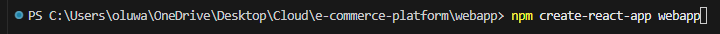
 
This installs the all the required configuration files and dependeny in our webapp directory. 

## Continuous Integration and Deployment (CI/CD) Workflow for Backend API

## Setting up Github workflow

In our backend api, create a new file, name it `build-and deploy.yml` this is 

**Explanation of the script**

 <u>Step1: Checkout Action</u>

Checks out your repository so the workflow can access the code

 <u>Step 2: Set up Node.js</u>

This installs and configures the specifies Node.js version, in the workflow. We've used Node version 22

<u>Step 3: Cache Node.js dependencies in the api directory</u>

It caches Node.js dependencies to speed up builds by avoiding repetitive npm install runs.

 <u>Step 4: Installs Dependencies</u>

Installs step uses a shell command (`npm ci`), "CI" means clean install. It installs dependices based on `package-lock.json`

 <u>Step 5: Run test</u>

Also a shell command (`npm test`). This executes the test suite.

Note that to run a test, a separate test file must be created named as `index.test.js`. And our `package.json` has already been defined the test script from above.

<u>Step 6: Building the application</u>

Another shell command (`npm run build`). It tells the Node Package Manager (npm) to execute a script named `build` that's defined in the project's root directory package.json file. 

You would notice what we echoed "No build step necessary for this Express app"
A couple of reason why we have this 

1.  Pure JavaScript Runtime: `Node.js` executes JavaScript files directly. There's no compilation, bundling, or transpilation required unless you're using TypeScript or JSX.
2.  No Frontend Assets to Compile: Since we are working purely with backend logic (routes like /orders, /login), there's no HTML, CSS, or frontend JavaScript being built or bundled.
3.  Direct node index.js Execution: Our entry file index.js runs as-is using the Node.js runtime, which means your application boots immediately with no transformation.

<u>Step 7: Set up Docker Buildx</u>

This sets up Docker Buildx, an advanced tool for building Docker images.

<u>Step 8: Configure AWS Credentials BEFORE any ECR operations</u>

While we are logged in as the root user on AWS, we retrieved security credentials by going to the Account ID section.
We created an Access key and Secret access key, as well as the AWS region we are operating in, we stored these credentials in github action repository secrets. This would enable us to securely log into the AWS console. 

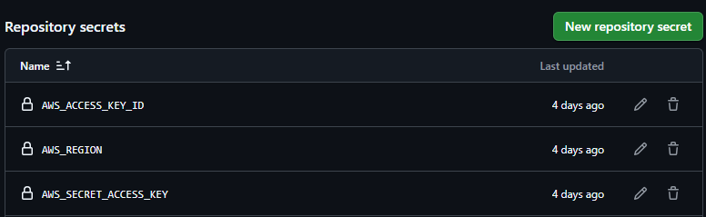

<u>Step 9: Login in to Amazon ECR so docker/build-push action can push </u>

Created the ECR repository on the Amazon console, with the credentials ECR_REPOSITORY and ECR-REGISTRY stored in github secrets 
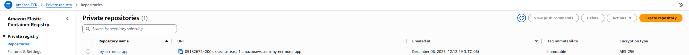

*A crucial order of step: Its very important to configure the login to AWS and ECR early in the workflow, or before further action, it tells github action that the repository exists, prevents errors / bugs or authorization failure*  

### dockerfile

The containerized application where our file lives remotely

To push a docker image, we need a `dockerfile.backend`, we created and placed this file in our root repository.

*Note: Its important to place `dockerfile.backend` in the project's root directory, this enables us to establish the root as the build context and gives us the flexibility to copying files from any subdirectory (i.e. api), In otherwords, we reference `dockerfile.backend` as the parent directory,and `api` and subfolders ans the sub directories*

<u>Dockerfile: script Explanation</u>

- Specifies what base image we want to use from Docker. `node:22-alpine` lightweight official Docker image for Node.js version 22. 

- We set the working directory as to `/app`(also known as the root directory `.`), where the Docker container's filesystem will be located.  

- The line `COPY package*.json ./` instructs Docker to copy any file from the current local directory that matches the pattern `package*.json` - typically `package.json` and `package-lock.json` - into the container’s working directory (/app). 

    *By isolating this step before installing dependencies with `npm ci`, Docker can cache the result of the installation.
    This means that if these files haven’t changed between builds, Docker will reuse the cached dependency layer—avoiding a fresh install and significantly speeding up the build process*

- `npm ci --only=production` excludes packages listed under `devDependencies` in our `package.json`. Installing only what is needed to run the app- not what's needed to develop or test it, hence, it speeds up run time. 
 

- We copied the built files from the `api` into the container's root directory `.`  (*remember we've set the container's root directory as `.app` from WORKDIR*)

- We've exposed our app to port 3000, the default express server port our app (index.js) listens to. 

- Finally, run the `node api/index.js` application when the container starts up

<u>Step 10: Build and push Docker image directly to ECR</u>

This GitHub Actions workflow step handles the containerization and deployment of your e-commerce API to Amazon's Elastic Container Registry (ECR). It uses the official docker/build-push-action@v3 action, which is a specialized tool designed to streamline Docker image builds in CI/CD pipelines.

- `context .` tells Docker to use the current repository root as the build context. 

- file : `./dockerfile.backend` explicity specifies which Dockerfile use

- `push:true`: instructs the action to images to the ECR after successful build

- `no-cache:true`: option forces Docker to rebuild every layer from scratch without using cached layers from previous builds. While this increases build time, it ensures you're getting a completely fresh build, which can be valuable for catching dependency issues or ensuring the latest security patches are applied.

- `tags`: Constructs the full image using Github secrets. It comobines {{ secrets.ECR_REGISTRY }} (your AWS ECR registry) URL,  with {{ secrets.ECR_REPOSITORY }} (your specific repository name,  and tags it as latest 

We created a new private repository on the amazon console and obtained these information 

**ECR_REPOSITORY** : This is same as the repository name: **my-ecr-node-app** 

   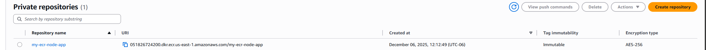 

**ECR_REGISTRY** found in ECR Repository URL. The ECR_REGISTRY is part of the repository URL : **051826724200.dkr.ecr.us-east-1.amazonaws.com**

All this is stored in out github repository secrets. 

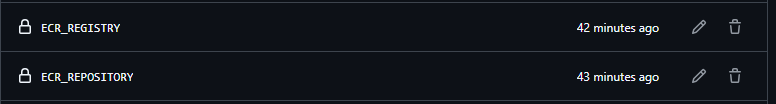

<u> Deploy to Amazon ECS </u>

This next step enables us to deploy the container image from ECR to ECS using the appropriate credentials and secrets we have set up for it.

In other to deploy to ECS, we need to create a cluster (ECS_CLUSTER) and Cluster service (ECS_SERVICE) on the amazon console.

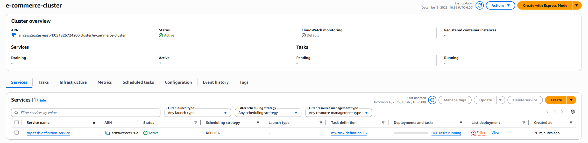

**Note: the task deployment failed, cause we have not pushed our docker image to ECR, this will change whenever we trigger our github workflow**

To set up our cluster service , we need a **task-definition** (aka my-task-definition-service)

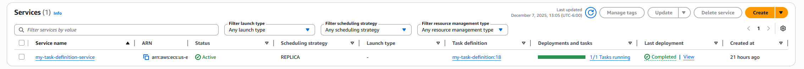

### Task Definition Configuration

Our task definition uses this configuration; 

- AWS FARGATE 
- 0.25 vCPU, 0.6GB of memory
- Host port : Container port is 3000 (*notice that we've used the same container port in the docker container*)
- Assigns  *ecsTaskExecutionRole* 
- Enables CloudWatch log connection

For our task definition service, we used ECR container image and image URL

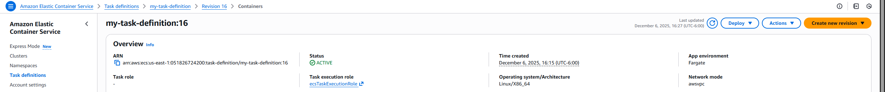

 **ECS pulls the container image from the ECR in a way that's set up in our task definition**

#### ecs-task-def.json

We've created an `ecs-task-def.json` file in our project workfile that mirrors the  task-definition on our console. This is done just for easier readabiliy. Note that when we deploy our workfile, the configuration in `ecs-task-def.json` file will overwrite any configuration we've set up for task-definition on the Amazon console.

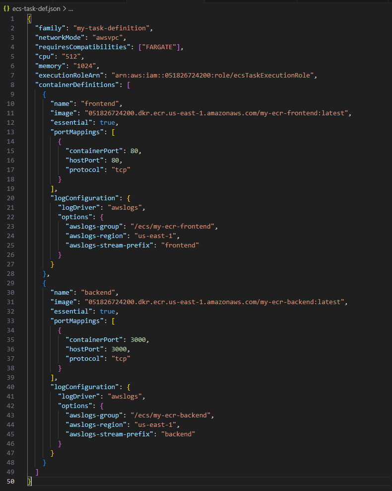

Similar to the task definition on our console, our container definition pulls from the ECR image 

logConfiguration from our task definition file  enables us to integrate Cloudwatch 
To setup Cloudwatch, create new log group and set the group name to ecs/my-ecr-node-app

Then navigate to Cloud watch- Log Management and set a log group with the same exact name - /ecs/my-ecr-node-app

CloudWatch enables advanaced infrastructure monitoring of our container, as well as error identification and debugging.

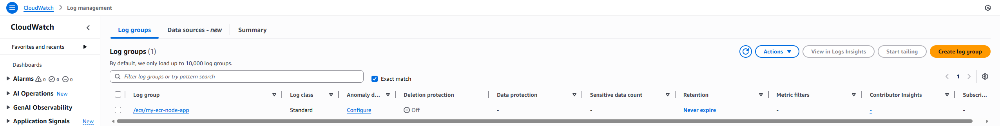

To finish setting our Cluster service, we need a VPC,
our VPC subnet is private and it allows both inbound and outbound traffic on port 3000. 

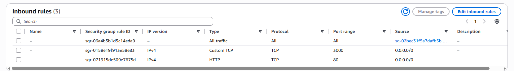

## Continuous Deployment Workflow for Our Backend API

